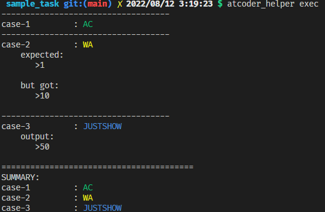

# atcoder_helper

atcoder出場を手助けするCLIツールです。

# install

`pip install atcoder-helper`

PyPI: https://pypi.org/project/atcoder-helper/

# 使い方

## 最初の初期化

`atcoder_helper config init`コマンドにより、 `$HOME/.atcoder_helper` 以下に設定ファイルが作成されます。

## 準備

問題を解くディレクトリの中で以下の準備をします。

### ディレクトリの作成・初期化

`atcoder_helper task create <コンテスト名> <問題名>` コマンドを実行し、ディレクトリを作成して初期化します。
たとえば、ABC160のA問題であれば `atcoder_helper abc160 a`のようにコマンドを打ちます。

このコマンドにより、問題を解くための雛型が生成されます。また、ビルドコマンド・実行コマンド、問題などの情報を記したタスク設定ファイル`.atcoder_helper_task_config.yaml`が生成されます。

### テストケースの取得
作成されたディレクトリに移動し、`atcoder_helper fetch`コマンドを実行します。
取得したテストケースはtestcases.yamlに保存されます。

## 問題を解いているとき

`atcoder_helper exec` で以下のような実行結果を得ることができます。

# tips
- testcases.yamlのtestcaseにexpectedを指定しないテストケースを作成すると、そのケースはJUSTSHOW扱いになり、正答との比較はスキップされ、出力結果の表示だけが行われます。
- 新規にディレクトリを作成せず、その場のディレクトリを初期化する atcoder_helper task init コマンドも存在します。
  - その場合、 task configファイルを自分で設定するか、あるいは `atcoder_helper fetch --contest <contest> --task <task>`のようにすることで、特定の問題のテストケースを取得できます。
- 現在、古い時代のコンテストに対応していないことを把握しています。
